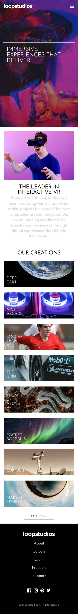
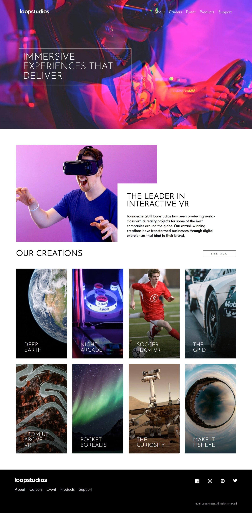

# Frontend Mentor - Loopstudios landing page solution

This is a solution to the [Loopstudios landing page challenge on Frontend Mentor](https://www.frontendmentor.io/challenges/loopstudios-landing-page-N88J5Onjw). Frontend Mentor challenges help you improve your coding skills by building realistic projects. 

## Table of contents

- [Overview](#overview)
  - [The challenge](#the-challenge)
  - [Screenshot](#screenshot)
  - [Links](#links)
- [My process](#my-process)
  - [Built with](#built-with)
  - [What I learned](#what-i-learned)
  - [Continued development](#continued-development)
  - [Useful resources](#useful-resources)
- [Author](#author)
- [Acknowledgments](#acknowledgments)

## Overview

### The challenge

Users should be able to:

- View the optimal layout for the site depending on their device's screen size
- See hover states for all interactive elements on the page

### Screenshot

### Links

- Solution URL: [Add solution URL here](https://your-solution-url.com)
- Live Site URL: [Add live site URL here](https://your-live-site-url.com)

## My process

### Built with

- Semantic HTML5 markup
- CSS custom properties
- Flexbox
- CSS Grid
- Mobile-first workflow
- [React](https://reactjs.org/) - JS library
- [Styled Components](https://styled-components.com/) - For styles

### What I learned

In this project, I learned how to create an overlapping cart structure. I also learned about different solutions for responsive gallery design.

### Continued development

I didn't use Tailwind CSS in this project. I use pure CSS in my projects to better understand it. However, I plan to continue using Tailwind within React in my future projects. Also, as the scope of my projects expands and different requirements arise, I aim to learn and use frameworks like Next.js and Tanstack in my projects.

### Useful resources

- [Una](https://una.im/) - If you are a developer reading this Readme, follow this developer who will give you information about Grid structure and colors. Their writings have helped broaden my perspective, both specifically in this project and generally.

## Author

- Frontend Mentor - [@Dov07](https://www.frontendmentor.io/profile/yourusername)
- İnstagram - [Olcay Vural](https://www.instagram.com/olcay.vural)
- Linkedın - [@OlcayVural](https://www.linkedin.com/in/olcay-vural-b44b18179/)

